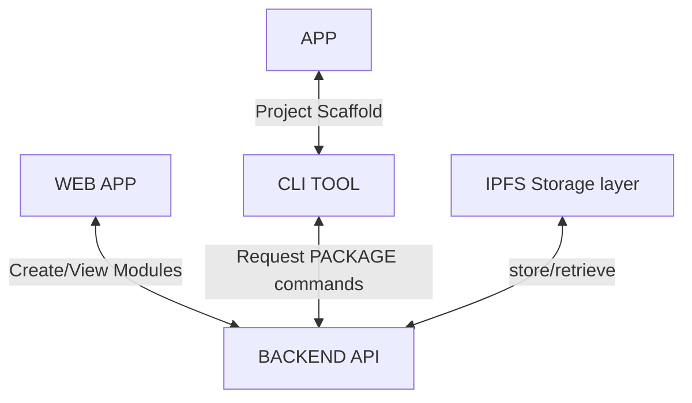

<div id="top"></div>

[![Contributors][contributors-shield]][contributors-url]
[![Forks][forks-shield]][forks-url]
[![Stargazers][stars-shield]][stars-url]
[![Issues][issues-shield]][issues-url]
[![MIT License][license-shield]][license-url]
[![LinkedIn][linkedin-shield]][linkedin-url]


<!-- PROJECT LOGO -->
<br />
<div align="center">
  <a href="https://github.com/IKalonji/pyGet">
    
  </a>

  <h3 align="center">pyGet</h3>

  <p align="center">
    pyGet is a Decentralized python package manager for developers using IPFS. 
    <br />
    <a href="https://github.com/IKalonji/pyGet/blob/main/README.md"><strong>Explore the docs »</strong></a>
    <br />
    <br />
    <a href="https://youtu.be/o7FZoPOkw3Q">View Demo</a>
    ·
    <a href="https://github.com/IKalonji/pyGet/issues">Report Bug</a>
    ·
    <a href="https://github.com/IKalonji/pyGet/issues">Request Feature</a>
  </p>
</div>

## Inspiration

To onboard more developers into the web3 space we need to provide tools that most developers are familiar with.
Package managers are one of the fundamentals to the development lifecycle. 

Although we currently make use of traditional package management like NPM, Nuget and PIP, none of these are decentralized. We would like to make it easier 
for developers to publish packages and grow the decentralized storage ecosystem.

## Demo Video

[](https://youtu.be/o7FZoPOkw3Q)

## How it works



Developers would publish their work using the Web app and that would be stored on IPFS. Developers wanting to make use of said package would scaffold an
app using the CLI and install the packages as request, upon install the package is retrieved from IPFS and added to the project dependencies.

Available CLI commands for the current iteration:
* pyGet init (Scaffold new project)
* pyGet install package-name (Add package to the dependencies)
* pyGet list (Lists available packages)
* pyGet uninstall (Remove from project dependencies)


## Future developments

* Data encryption
* Make pyGet open to the public
* Improve file handling 
* Resolve dependencies required by installed package 

## Challenges faced

Getting the files from the GET endpoint was a bit challenging especially when it involves a CAR file.

## Running the project

* Requires Python 3.6+
* API KEY from Tatum for IPFS data storage

1. Clone the repo.

```sh
git clone https://github.com/IKalonji/pyGet.git
```

2. Insert API KEY into ipfs_requests.py.

3. In pyGet-API folder run app.py

4. For the Web App Angular is required, navigate to pyGet-WEBAPP and run npm install.

5. Run ng serve --open

6. Finally for the CLI, navigate to pyGet-CLI, run the setup script and run pyget.py

## Acknowledgements

* IPFS/Filecoin
* Devpost

## Licenses

The project is open source under the MIT License, please see the license file.

[contributors-shield]: https://img.shields.io/github/contributors/IKalonji/pyGet.svg?style=for-the-badge
[contributors-url]: https://github.com/IKalonji/pyGet/graphs/contributors
[forks-shield]: https://img.shields.io/github/forks/IKalonji/pyGet.svg?style=for-the-badge
[forks-url]: https://github.com/IKalonji/pyGet/network/members
[stars-shield]: https://img.shields.io/github/stars/IKalonji/pyGet.svg?style=for-the-badge
[stars-url]: https://github.com/IKalonji/pyGet/stargazers
[issues-shield]: https://img.shields.io/github/issues/IKalonji/pyGet.svg?style=for-the-badge
[issues-url]: https://github.com/IKalonji/pyGet/issues
[license-shield]: https://img.shields.io/github/license/IKalonji/pyGet.svg?style=for-the-badge
[license-url]: https://github.com/IKalonji/pyGet/blob/main/LICENSE.txt
[linkedin-shield]: https://img.shields.io/badge/-LinkedIn-black.svg?style=for-the-badge&logo=linkedin&colorB=555
[linkedin-url]: https://www.linkedin.com/in/issa-kalonji-b301851ba/
